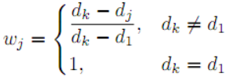

# KNN
KNN,  weighted KNN, kd tree

## dataset
* MINIST

## KNN algorithm implementation

### Basic process
* Initial hyperparameter k and distance measurement method.
* Traverse the test data:
  * Traverse the train data:
    * For each training data, calculate the distance between each training data and the current test data according to the initialized distance measurement method.
    * Then select the k training data with the shortest distance from the current test data (each training data has a corresponding label, and the k labels may be duplicated). The label of the current test data is marked as the one with the most occurrences among the k labels.

### Different distance measurement methods

* Euclidean distance
* Manhattan distance

## Weighted KNN
* Normalization

&emsp;Where $d_{j}$ is the k smallest distances arranged from small to large.

* Reciprocal

&emsp;Where ``const`` is a constant to avoid weights becoming too large or even infinite when the distance is small.

* Gaussian

&emsp;After obtaining the k shortest distances according to the previous method, calculate the corresponding weights using a specific weighting method, and mark the label of the current test data as the label with the largest sum of weights. In fact, the previously unweighted KNN is equivalent to the special case where the k shortest distances are all given a weight of 1.

## KD tree: A faster way to find the nearest neighbor

&emsp;KD tree is a kind of space partition tree. By storing the points in K dimension space in the form of binary tree, we can retrieve them quickly. In the process of constructing a KD tree, the k-dimensional space is continuously divided by hyperplanes perpendicular to the coordinate axis to form a series of k-dimensional hyperrectangles, each of which corresponds to a node of the KD tree. Using KD tree can save the search of most data points, so as to speed up the search.

&emsp;The method of constructing KD tree can be simply described as follows: first, select a segmentation dimension, sort the data in ascending order on the segmentation dimension, take the data points corresponding to the median as the root node, the data points corresponding to the left of the median enter the left child node space of the root node, and the data points corresponding to the right of the median enter the right child node space. In the left and right child node spaces, the process of selecting segmentation dimension and root node is repeated until there is only one node in each child space.

&emsp;The process of searching in the kd tree can be briefly described as follows: First, compare the data point to be searched with the root node of the kd tree constructed above. If it's smaller than / equal to the root node in the segmentation dimension, then enter the left child node space of the root node to continue searching, otherwise enter the right child node space, repeat the process until the leaf node is reached. Thus we can get a search path consisting of the root nodes of each space. Then for the search path (simultaneously calculating distances in this process and maintaining k shortest distances), roll back each node (back to the root node of the kd tree), and for each node, perform the following operations:
* If the distance between the data point to be searched and the hyperplane corresponding to the current node is less than the maximum of k shortest distances, enter another child node space of the current node (if the node to be searched is in the left child node space of the current node, enter the right child node space, otherwise enter the left child node space), and build a search path with the current node's child node as the root node (in this process, calculate the distance at the same time, maintain k shortest distances), and add them to the previous search path.
* If the distance between the data point to be searched and the hyperplane corresponding to the current node is greater than / equal to the largest of k shorted distances, it means that there can be no node with a shorter distance in another child node space of the current node, so we can skip the search for this subspace directly.
